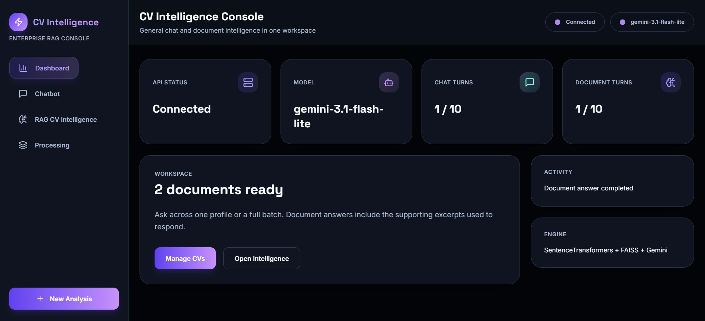
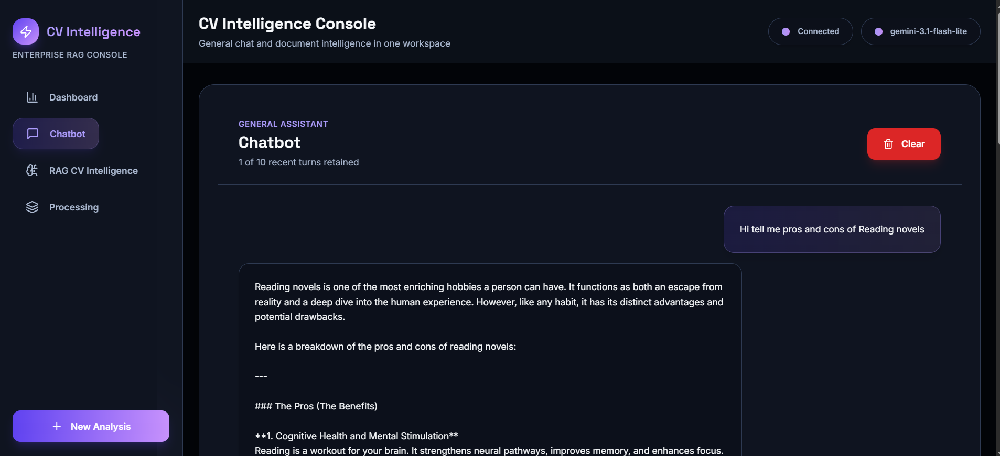
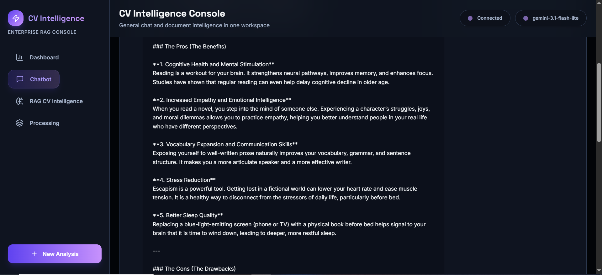
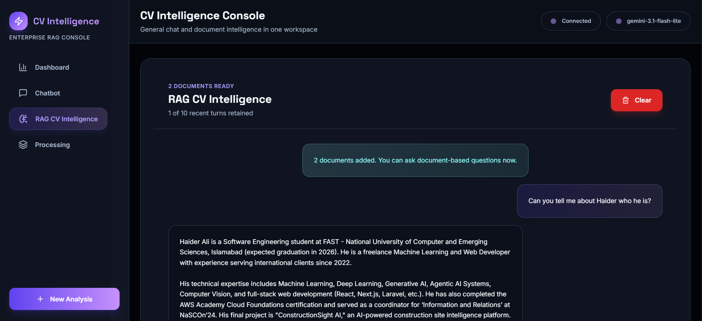
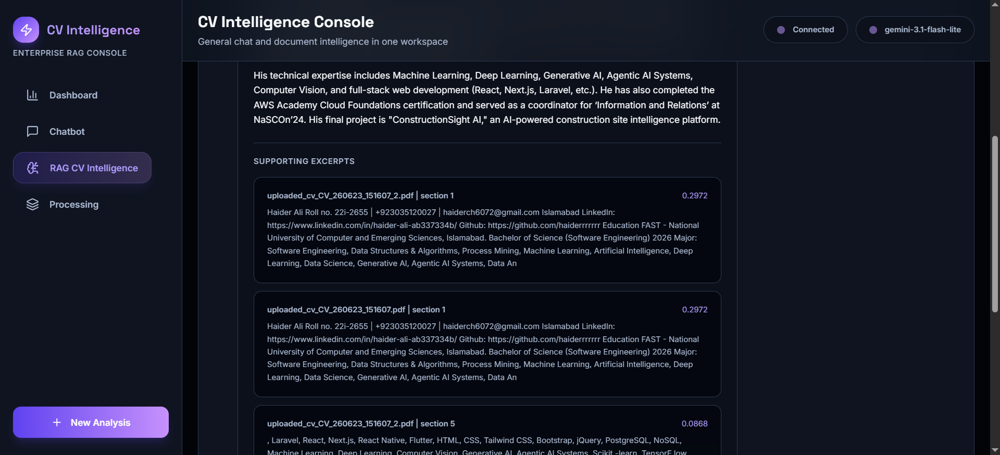
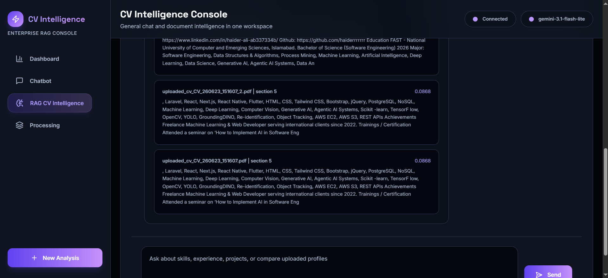
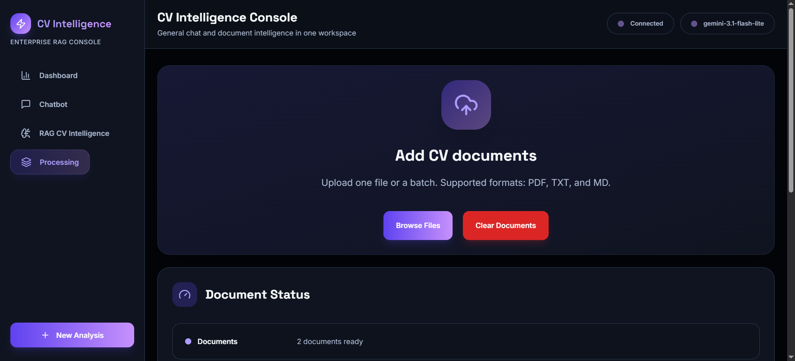

# CV Intelligence RAG Chatbot

A full-stack AI chatbot and CV intelligence platform built with FastAPI, Next.js, Gemini, SentenceTransformers, FAISS, and Docker. Users can ask general chatbot questions, upload one or multiple CV files, and receive grounded RAG answers with source snippets.

## Live Preview

Frontend:

https://cv-intelligence-rag-chatbot.vercel.app

Backend:

https://cv-intelligence-api.onrender.com

API Docs:

https://cv-intelligence-api.onrender.com/docs

## Features

- Ask general questions through a Gemini-powered chatbot.
- Upload one or multiple CV files for document-based question answering.
- Retrieve CV context with SentenceTransformers embeddings and FAISS search.
- Return RAG answers with supporting document names, chunk numbers, scores, and snippets.
- Keep separate 10-turn memories for general chat and CV intelligence.
- Clear chatbot history, CV history, uploaded documents, or start a new analysis.
- Run locally with Python, Node.js, or Docker Compose.
- Deploy backend on Render and frontend on Vercel.

## Evaluation Coverage

| Requirement | Implementation |
| --- | --- |
| Build a chatbot using a lightweight LLM that can answer any query | `/chat` uses the Gemini-powered chatbot service, while `/open-source-chat` keeps an optional lightweight local LLM path using Qwen 0.5B. |
| Build RAG using the chatbot and feed it a CV | `/upload-cv` and `/upload-cvs` accept CV documents, extract text, chunk content, embed chunks, retrieve matches with FAISS, and answer through the chatbot model. |
| Convert RAG into an API with at least 10 questions and answers as context | FastAPI exposes `/ask`, `/history/rag`, and `/history/chat`; each memory stream keeps the latest 10 question-answer turns separately. |
| Build Docker support and make the API executable | `backend/Dockerfile`, `frontend/Dockerfile`, and `docker-compose.yml` run the full stack with backend on port `8000` and frontend on port `3000`. |
| Put tasks into separate Python modules | Backend logic is split across `chatbot.py`, `open_source_llm.py`, `cv_loader.py`, `vector_store.py`, `rag.py`, `memory.py`, `config.py`, and `api.py`. |
| Include README and requirements.txt | Setup, deployment, API routes, and environment variables are documented here, with dependencies listed in `backend/requirements.txt` and root `requirements.txt`. |

## Tech Stack

| Part | Tech |
| --- | --- |
| Frontend | Next.js 16, React 19, TypeScript, Tailwind CSS, Lucide icons |
| Backend | Python 3.12, FastAPI, Pydantic, Uvicorn |
| LLM | Gemini API |
| Optional local LLM | Hugging Face Qwen 0.5B |
| RAG | SentenceTransformers, FAISS, PyPDF |
| Deployment | Render, Vercel, Docker, Docker Compose |

## Screenshots

### Dashboard



### Chatbot





### RAG CV Intelligence







### Processing



## Project Structure

```text
.
|-- backend/             # FastAPI API, chatbot, RAG, memory, and CV processing
|-- frontend/            # Next.js frontend
|-- docs/                # Architecture notes
|-- assets/              # README screenshots
|-- docker-compose.yml   # Local full-stack Docker setup
|-- render.yaml          # Render backend blueprint
|-- requirements.txt     # Root dependency reference
`-- README.md
```

## Environment Variables

Create `backend/.env` from `backend/.env.example`.

```env
GEMINI_API_KEY=your_gemini_key
GEMINI_MODEL=gemini-3.1-flash-lite
EMBEDDING_MODEL=sentence-transformers/all-MiniLM-L6-v2
MAX_HISTORY=10
```

For the deployed frontend, set this in Vercel:

```env
NEXT_PUBLIC_API_URL=https://cv-intelligence-api.onrender.com
```

## Run Locally

Start the backend:

```bash
cd backend
py -3.12 -m venv venv
venv\Scripts\activate
python -m pip install --upgrade pip
pip install -r requirements.txt
python -m uvicorn app.api:app --reload
```

Start the frontend in another terminal:

```bash
cd frontend
npm install
npm run dev
```

Open:

```text
http://localhost:3000
```

API documentation:

```text
http://localhost:8000/docs
```

## Run With Docker

Create `backend/.env`, then start the full stack:

```bash
docker compose up --build
```

Open:

```text
Frontend: http://localhost:3000
Backend API docs: http://localhost:8000/docs
```

Stop the app:

```bash
docker compose down
```

## Deployment

Backend deployment uses Render with `backend/Dockerfile` and `render.yaml`.

Required Render environment variables:

```env
GEMINI_API_KEY=your_gemini_key
GEMINI_MODEL=gemini-3.1-flash-lite
EMBEDDING_MODEL=sentence-transformers/all-MiniLM-L6-v2
MAX_HISTORY=10
UPLOAD_DIR=data
```

Frontend deployment uses Vercel from the `frontend` directory.

Required Vercel environment variable:

```env
NEXT_PUBLIC_API_URL=https://cv-intelligence-api.onrender.com
```

## Swagger API Testing

Open the interactive Swagger UI:

```text
https://cv-intelligence-api.onrender.com/docs
```

Use Swagger instead of Postman for the demo:

1. Run `GET /health` to show the backend is live.
2. Run `POST /chat` with a meaningful general question.
3. Run `POST /upload-cvs` to upload one or more CV files.
4. Run `POST /ask` to ask a CV-specific RAG question.
5. Run `GET /history/chat` and `GET /history/rag` to show separate 10-turn memories.

Recommended Swagger question examples:

```json
{
  "question": "Explain what this project does and which technologies it uses."
}
```

```json
{
  "question": "What skills, projects, and experience are mentioned in the uploaded CV?"
}
```

## API Routes

| Method | Route | Description |
| --- | --- | --- |
| `GET` | `/health` | Check API status and active model |
| `POST` | `/chat` | Ask the general chatbot |
| `POST` | `/ask` | Ask questions against uploaded CV context |
| `POST` | `/upload-cv` | Upload one CV |
| `POST` | `/upload-cvs` | Upload multiple CVs |
| `GET` | `/cvs` | List active uploaded CVs |
| `DELETE` | `/cv` | Clear uploaded CVs |
| `GET` | `/history/chat` | Read chatbot memory |
| `GET` | `/history/rag` | Read RAG memory |
| `DELETE` | `/history/chat` | Clear chatbot memory |
| `DELETE` | `/history/rag` | Clear RAG memory |
| `POST` | `/open-source-chat` | Use the optional lightweight local LLM path |

Example chatbot request:

```json
{
  "question": "Explain artificial intelligence in simple words."
}
```

Example RAG request:

```json
{
  "question": "What skills are mentioned in the uploaded CV?"
}
```

## Scripts

Frontend development:

```bash
cd frontend
npm run dev
```

Frontend production build:

```bash
cd frontend
npm run build
```

Backend development:

```bash
cd backend
python -m uvicorn app.api:app --reload
```

Docker:

```bash
docker compose up --build
```
